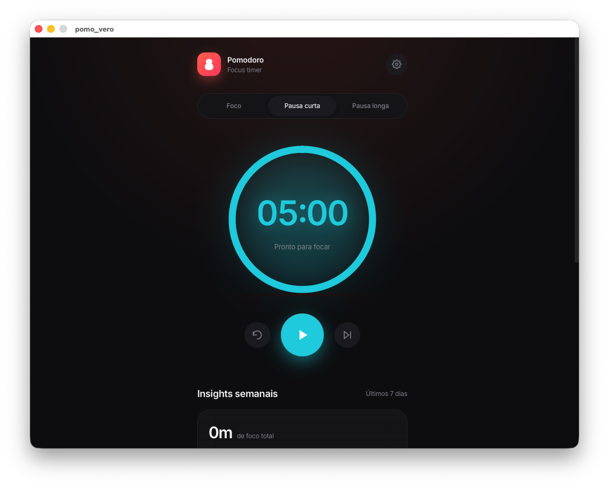
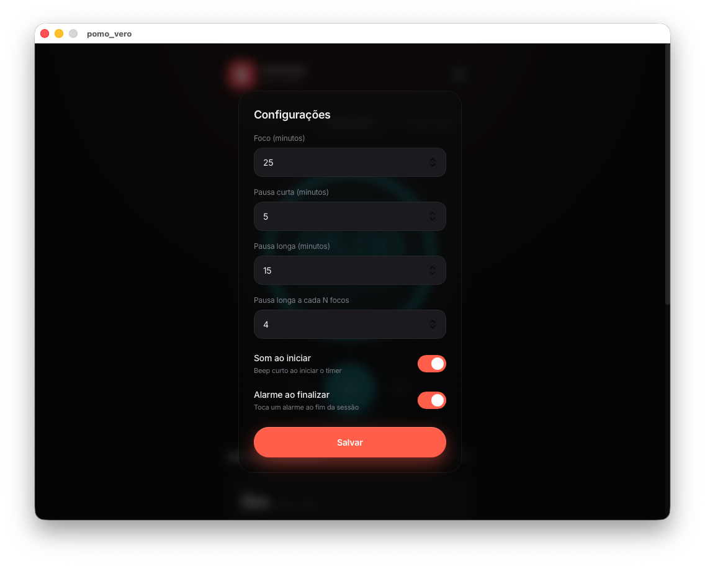
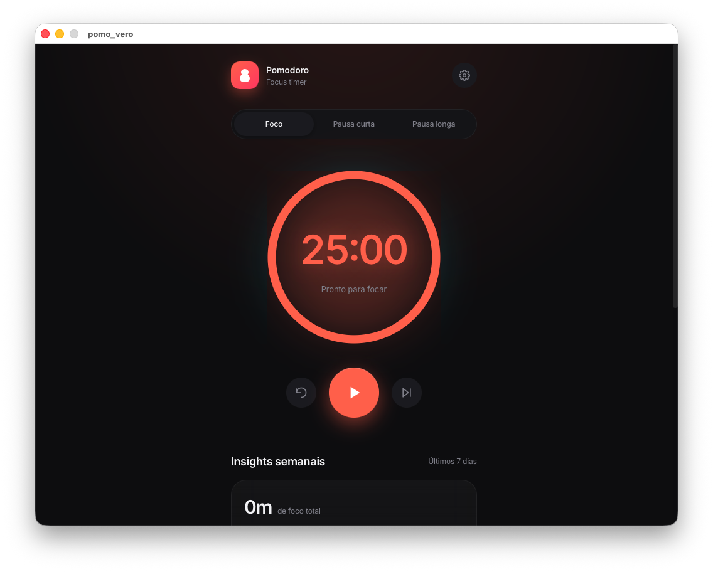

# Pomo Vero

> **pomo_vero** é um timer Pomodoro para desktop, construído com **Wails v2** (o "Electron alternativo para Go"). Combina um backend compilado em Go com um frontend web elegante em React/TypeScript dentro de uma **WebView nativa** do sistema, resultando em um binário de apenas ~9 MB com aspecto e sensação de aplicativo nativo.

## Capturas de tela

Screenshots da aplicação rodando nativamente no macOS:

<div align="center">

| | |
|:---:|:---:|
|  |  |
|  |  |

</div>

---

## 1. Resumo executivo

| Campo | Valor |
|-------|---------|
| Nome | `pomo_vero` ("Pomo Vero" — pomodoro real) |
| Tipo | Aplicação de desktop (timer de foco estilo Pomodoro) |
| Backend | Go 1.25 (novo linguagem Go, família V) + Wails v2.13.0 + SQLite (go-sqlite3) |
| Frontend | React 18 + TypeScript + Vite 7 + Tailwind CSS v4 + lucide-react |
| IPC | Wails Bindings (RPC) + Wails Events (pub/sub) |
| Persistência | SQLite3 (`session_logs.db`) |
| Binário | Mach-O 64-bit arm64, ~9 MB |
| Plataformas | macOS (WebKit) e Windows (Edge / WebView2) |

O fio condutor do projeto é **leveza + desempenho nativo**: em vez de empacotar um navegador completo (Electron), Wails usa a WebView do sistema operativo e um binário Go compilado, resultando em um executável de poucos MB que abre e responde como uma app nativa.

---

## 2. Arquitetura geral

```
┌───────────────────────────────────────────────┐
│  Janela nativa (macOS / Windows)              │
│  ┌───────────────────────────────────────────┐ │
│  │  WebView do sistema (WebKit / Edge)       │ │
│  │  ┌─────────────────────────────────────┐  │ │
│  │  │  Frontend (React + TypeScript)      │  │ │
│  │  │  App.tsx → TimerCard, Insights,      │  │ │
│  │  │           RecentSessions, Settings   │  │ │
│  │  │  usePomodoro.ts (hook central)       │  │ │
│  │  └──────────────┬──────────────────────┘  │ │
│  │                 │ IPC (RPC + Eventos)      │ │
│  │  ┌──────────────▼───────────────────────┐  │ │
│  │  │  Wails Bridge (auto-generado)        │  │ │
│  │  │  wailsjs/go/main/App.js     (RPC)    │  │ │
│  │  │  wailsjs/runtime/runtime.js (Eventos)│  │ │
│  │  └──────────────┬───────────────────────┘  │ │
│  └─────────────────┼──────────────────────────┘ │
│                    │                            │
│  ┌─────────────────▼──────────────────────────┐ │
│  │  Backend (Go)                              │ │
│  │  app.go → timer, SQLite, settings, logs    │ │
│  │  main.go → bootstrap Wails                 │ │
│  └────────────────────────────────────────────┘ │
└──────────────────────────────────────────────────┘
```

### Como se comunica o frontend com o backend

- **RPC (Bindings):** os métodos Go do struct `App` são expostos ao frontend como objetos JS auto-generados em `frontend/wailsjs/go/main/App.js` (ex. `StartTimer`, `StopTimer`, `GetSettings`, `SaveSettings`, `GetSessionLogs`).
- **Eventos (pub/sub):** o backend emite eventos que o frontend escuta via `EventsOn` (ex. `timer_tick` cada segundo e `timer_finished` ao terminar a sessão).
- **Chamadas nativas:** Wails fornece utilitários do sistema como `WindowMinimise()`, `WindowShow()` e `WindowUnminimise()`.
---

## 3. Stack tecnológico detalhado

### Backend (Go)

| Arquivo | Papel |
|---------|-------|
| `main.go` | Bootstrap de Wails: cria a instância `App`, configura título, tamanho 1024×768, `AssetServer` com o frontend embebido (`//go:embed`), `BackgroundColour` `#1B2636`, `OnStartup` e o `Bind` do struct `App`. |
| `app.go` | Lógica de negócio: inicialização de DB, configuração, timer em goroutine, persistência de sessões e API exposta ao frontend. |
| SQLite | `go-sqlite3` (via CGO). Base local com as tabelas `session_logs` e `settings`. |
| Timer | Coroutine (`go func`) com um `Ticker` de 1 s. Emite `timer_tick` e, ao chegar a 0, guarda a sessão, restaura a janela e emite `timer_finished`. Durante o foco, a janela se minimiza. |

### Frontend (React + TS)

| Componente | Papel |
|------------|-------|
| `main.tsx` | Entrada React, renderiza `<App />`. |
| `App.tsx` | Layout principal: header, selector de modos (Foco / Pausa curta / Pausa larga), TimerCard, Insights e RecentSessions. |
| `usePomodoro.ts` | **Hook central**: estado do timer, IPC (RPC + eventos), sons e lógica de alternância foco→pausa→pausa larga. |
| `TimerCard.tsx` | Timer circular em SVG com anel de progreso, glow e cor por modo. |
| `InsightsView.tsx` | Gráfico de barras de foco dos últimos 7 dias + estatísticas. |
| `RecentSessions.tsx` | Lista das últimas sessões registradas. |
| `SettingsView.tsx` | Modal de configuração (durações, intervalo de pausa larga, sons). |
| `sounds.ts` | Geração de sons com **Web Audio API** (100% local). |
---

## 4. Funcionalidades

### Timer Pomodoro
- Três modos: **Foco** (25 min), **Pausa curta** (5 min) e **Pausa longa** (15 min), todos configuráveis.
- O timer roda **no backend** (goroutine de Go), não no navegador: garante precisão e continua vivo mesmo se o frontend for recarregado.
- Ao terminar uma sessão de foco, decide automaticamente entre pausa curta e pausa longa conforme o intervalo configurável (pausa longa a cada N focos, por padrão a cada 4).
- O contador de focos completados é guardado em `localStorage`.

### Comportamento de janela (feeling nativo)
- Ao iniciar um bloco de foco, a janela **é minimizada** automaticamente para não distrair.
- Ao terminar, a janela **volta e é mostrada**, o som toca e uma **notificação do sistema** é disparada.

### Insights e estatísticas
- Foco total dos últimos 7 dias + gráfico de barras dia a dia.
- Quantidade de sessões com variação % em relação à semana anterior.
- Foco médio por dia.

### Configuração persistente
- Durações (segundos), intervalo da pausa longa e toggles de som são salvos no SQLite e recarregados na inicialização.

### Som (Web Audio API)
- **Som de início:** dois tons suaves (660 Hz → 880 Hz, senoidal).
- **Alarme:** 2 rodadas de 3 bipes (880 Hz quadrada + 1760 Hz senoidal).
- O `AudioContext` é criado sob demanda e reativado se ficar suspenso.

---

## 5. Persistência (SQLite)

O banco fica no diretório de configuração do usuário:
`~/Library/Application Support/pomo_vero/session_logs.db` (definido em `app.go` via `os.UserConfigDir()`).

### Tabela `session_logs`

| Coluna | Tipo | Descrição |
|--------|------|-----------|
| `id` | INTEGER PK | Auto-incremento |
| `type` | TEXT | `"focus"` ou `"break"` |
| `duration` | INTEGER | Duração em segundos |
| `created_at` | DATETIME | Timestamp de criação |

### Tabela `settings`

| Coluna | Tipo | Padrão | Descrição |
|--------|------|--------|-----------|
| `id` | INTEGER PK | — | Sempre 1 (única linha) |
| `focus_duration` | INTEGER | 1500 | Foco em segundos (25 min) |
| `break_duration` | INTEGER | 300 | Pausa curta em segundos (5 min) |
| `long_break_duration` | INTEGER | 900 | Pausa longa em segundos (15 min) |
| `long_break_interval` | INTEGER | 4 | Pausa longa a cada N focos |
| `start_sound_enabled` | INTEGER | 1 | Som ao iniciar (bool) |
| `alarm_sound_enabled` | INTEGER | 1 | Alarme ao finalizar (bool) |

> O banco é criado **uma única vez** com migrações idempotentes (`ALTER TABLE` tolerante à mensagem "duplicate column name") para bases existentes.
---

## 6. Comandos de desenvolvimento

```sh
# Modo desenvolvimento (hot-reload de frontend + backend Go)
wails dev

# Build de distribuição
wails build

# Build para macOS universal (Intel + Apple Silicon)
wails build -platform darwin/universal -clean

# Verificar o ambiente
wails doctor
```

O resultado do build fica em `build/bin/`. Para instaladores `.dmg`/`.pkg` assinados e notarizados, ver [`docs/INSTALADOR_MAC.md`](./INSTALADOR_MAC.md).

---

## 7. Glossário de arquivos relevantes

| Arquivo | Papel |
|---------|-------|
| `main.go` | Bootstrap de Wails, bind do `App`, configuração da janela. |
| `app.go` | Lógica de negócio: timer (goroutine), SQLite, configurações. |
| `wails.json` | Configuração do projeto Wails. |
| `go.mod` / `go.sum` | Dependências Go (Wails v2.13.0, go-sqlite3). |
| `frontend/src/main.tsx` | Entrada React. |
| `frontend/src/App.tsx` | Layout principal e orquestração dos componentes. |
| `frontend/src/usePomodoro.ts` | Hook central: estado, IPC, eventos e sons. |
| `frontend/src/TimerCard.tsx` | UI do timer circular (SVG). |
| `frontend/src/InsightsView.tsx` | Gráfico de foco semanal. |
| `frontend/src/RecentSessions.tsx` | Lista de últimas sessões. |
| `frontend/src/SettingsView.tsx` | Modal de configuração. |
| `frontend/src/sounds.ts` | Web Audio API para bipes e alarmes. |
| `frontend/wailsjs/*` | Bridge JS/TS e runtime Wails auto-gerados. |

---

## 8. Documentação relacionada

- [Arquitetura e comunicação Backend-Frontend](./ARQUITETURA.md)
- [Instalador para macOS](./INSTALADOR_MAC.md)
- [Texto para LinkedIn](./LINKEDIN_POST.md)